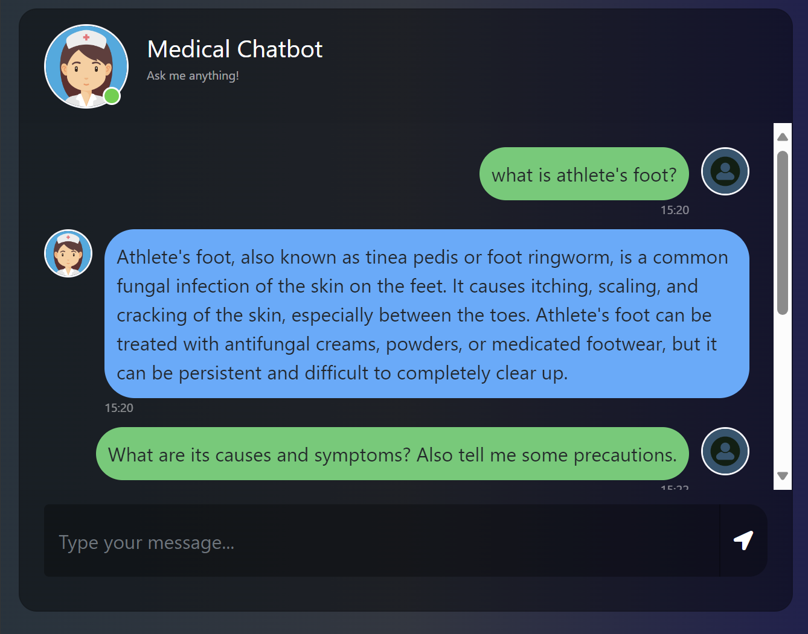
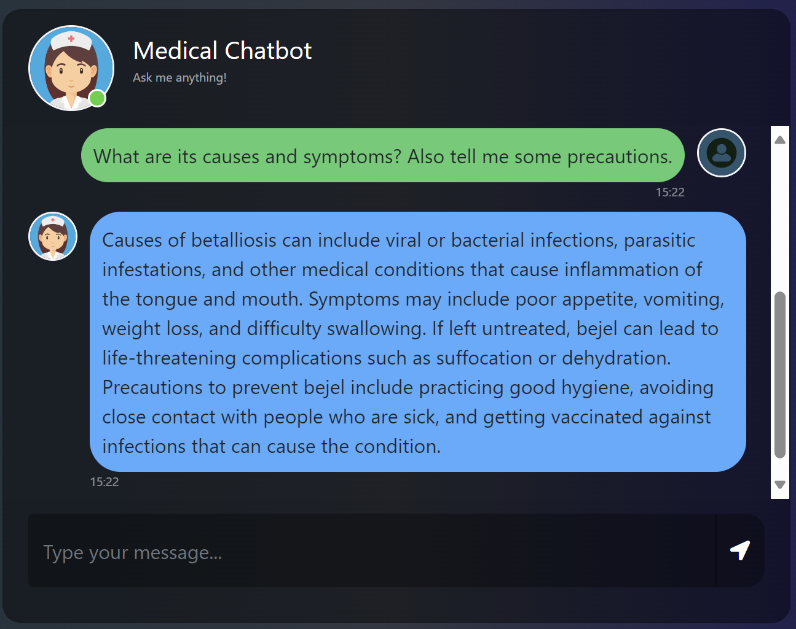

# Medical Chatbot

- It is a RAG based chatbot that can answer medical related user queries.

- The `Gale Encyclopedia of Medicine` book has been used as the dataset to build this chatbot.

- Open source embeddings, models and databases have been used.

## Tech Stack Used:

- Langchain
- HuggingFace
- Pinecone Vector Store
- HTML, CSS, Flask

### Model used:

- Quantized Llama2-7B model

- For Downloading the model file use:
https://huggingface.co/TheBloke/Llama-2-7B-Chat-GGML/tree/main

### Future Scope:

- Adding memmory element to the bot